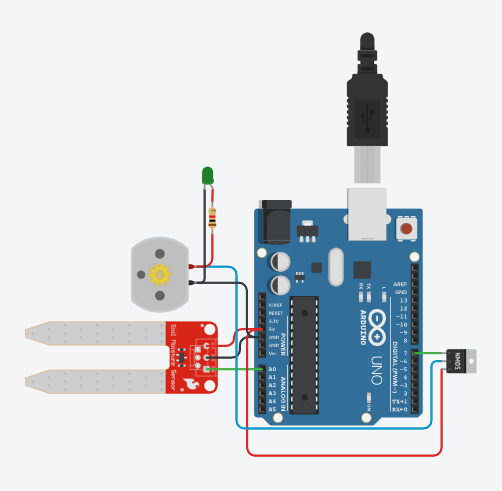
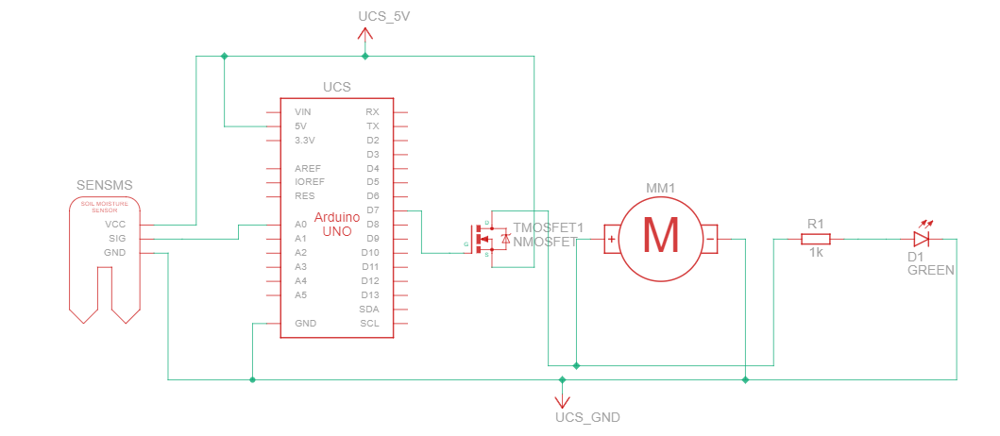

# Arduino Automated Plant Watering System with NMOSFET Motor Control and LED Indicator

## Description

This project is an automated plant watering system that uses an Arduino, a soil moisture sensor, an NMOSFET, and a water pump motor. The system continuously monitors the soil moisture level and automatically activates a water pump when the soil becomes too dry. The motor control is managed by an NMOSFET, which efficiently switches the pump on and off. Additionally, a green LED is incorporated to provide a visual indication whenever the pump is running. This system ensures that your plants receive water only when necessary, preventing both under and overwatering. It's a perfect project for automating plant care and exploring basic electronics with Arduino.

## Configuration



## Components Required
- **Arduino Uno (or compatible board)**
- **Soil Moisture Sensor**
- **Pump Motor**
- **NMOSFET (e.g., IRF540N)**
- **Resistor (1 kΩ) for LED**
- **Diode (1N4007)** (for back EMF protection)
- **Green LED**
- **Power Supply (5V for the Arduino and pump motor)**
- **Breadboard and Connecting Wires**
- **Water Reservoir** (for the pump to draw water from)

## Schematic



## Setup Instructions

1. **Wiring the Components:**
   - Connect the soil moisture sensor to the Arduino (VCC to 5V, GND to GND, SIG to A0).
   - Connect the pump motor through the NMOSFET to the Arduino (motor positive to 5V, motor negative to the Drain of the NMOSFET, Source to GND).
   - Connect the Gate of the NMOSFET to Arduino pin D8 through a 1kΩ resistor.
   - Place a 1N4007 diode across the motor terminals to protect against back EMF.
   - Connect the LED with a 1kΩ resistor across the motor terminals for a visual indicator.

2. **Upload the Code:**
   - Connect your Arduino to your computer.
   - Open the Arduino IDE and upload the provided code to the Arduino board.

3. **Testing:**
   - Place the soil moisture sensor in the soil.
   - Monitor the serial output to check the soil moisture readings.
   - The pump should activate when the soil is dry and deactivate when it’s sufficiently moist.

## Code Explanation

The code reads the analog input from the soil moisture sensor. If the moisture level falls below the `lowerThreshold` (dry soil), the Arduino sends a HIGH signal to the NMOSFET gate, allowing current to flow through the motor, powering the pump. The pump continues to run until the moisture level reaches the `upperThreshold`, at which point the NMOSFET gate is driven LOW, cutting off power to the motor.

```cpp
// Pin Definitions
const int moistureSensorPin = A0; // Soil moisture sensor connected to A0
const int motorPin = 8;           // NMOSFET gate connected to digital pin 8
const int lowerThreshold = 400;   // Lower threshold for moisture level to start pumping
const int upperThreshold = 500;   // Upper threshold to stop the motor

void setup() {
  Serial.begin(9600);  // Initialize serial communication
  pinMode(motorPin, OUTPUT);  // Set motor pin as output
  digitalWrite(motorPin, LOW);  // Start with motor off
}

void loop() {
  int moistureLevel = analogRead(moistureSensorPin);  // Read moisture level
  Serial.print("Moisture Level: ");
  Serial.println(moistureLevel);

  if (moistureLevel < lowerThreshold) {
    digitalWrite(motorPin, HIGH);  // Turn on the motor
    Serial.println("Motor ON - Pumping Water");
  } else if (moistureLevel >= upperThreshold) {
    digitalWrite(motorPin, LOW);  // Turn off the motor
    Serial.println("Motor OFF - Soil Moisture Adequate");
  }

  delay(1000);  // Delay to avoid too frequent readings
}
